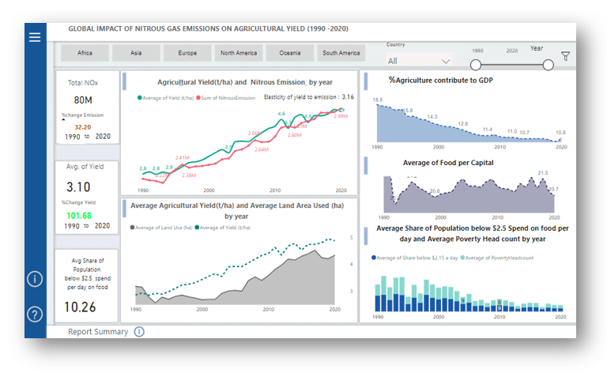
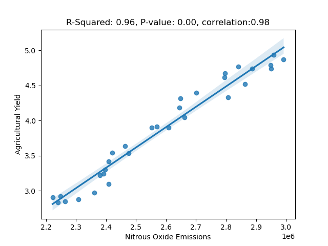

# Agricultural Productivity and Nitrous Oxide Emissions: A Global Perspective (1990-2020)

**[View Visualization on Power BI](https://app.powerbi.com/groups/me/reports/45dd7fda-7ffb-4392-8a33-076e6409e97a?ctid=e7c75c77-8909-4665-967c-fdaa53193a06&pbi_source=linkShare)**

## Introduction

The interplay between agricultural productivity and environmental sustainability has become a focal point of global research and policy discussions, particularly in the context of climate change and its associated emissions. Nitrous oxide (N₂O), a potent greenhouse gas, has been identified as a significant contributor to global warming, with agricultural practices being a primary source of its emissions (IPCC, 2014; Mosier et al., 1998). As the global population continues to rise, the demand for agricultural output has led to intensified farming practices, which in turn have escalated N₂O emissions (Davidson, 2009).

This visualization seeks to investigate the relationship between agricultural yield and nitrous oxide emissions from 1990 to 2020, with a specific focus on identifying trends, correlations, and the socio-economic impacts of these variables on a global scale. Through an in-depth analysis of agricultural yield data and N₂O emission levels, the project aims to elucidate the extent to which increased agricultural productivity has influenced greenhouse gas concentrations and vice versa.

Moreover, the project examines the broader implications of these trends, including the effects on global food security, global poverty, and land efficiency (FAO, 2021). Understanding these dynamics is crucial for informing sustainable agricultural practices and policies that balance the need for increased food production with the imperative to mitigate environmental impacts.

By analyzing historical data and identifying key periods of significant change, this project aims to contribute to the ongoing discourse on the environmental impact of agricultural practices and provides insights into how future agricultural policies might be shaped to promote both productivity and sustainability (Smith et al., 2007).

## Summary of Visualization and Analysis

### 1. Agricultural Yield Trends

- **General Increase:** Agricultural yield has shown a steady increase from 1990 to 2020.
- **Significant Spikes:** Notable spikes in agricultural yield was observered in 2009, with average yields of 4.6 tonnes per hectare.

### 2. Nitrous Oxide Emission Trends

- **Increase Over Time:** Nitrous oxide emissions have also increased from 1990 to 2020.
- **Key Spikes:** Major spikes in emissions occurred in 2007 and 2011.

### 3. Correlation Between Yield and Emissions

- **Statistical significant Relationship:** The linear regression analysis shows that there is statistically significant relationship between nitrous oxide emissions and agricultural yield changes, which indicate that nitrous oxide emissions impact agricultural yield. The positive slope suggests that increases in nitrous oxide emissions are associated with increases in agricultural yield in the same year also the R-squared value also indicates that 96% of agricultural yield changes can be explained by nitrous emission.

- **Significant Impact (2010-2020):** The changes in agricultural yield to nitrous emission is highly responsive during this period, potentially due to higher concentrations of nitrous oxide in the atmosphere.

- **Less Impact (1990-2010):** The response of agricultural yield to nitrous emission is less from 1990-2010

### 4. Economic and Social Impact

- **Decline in Agricultural Value Added to Gross per Capital:** The decline in agriculture's contribution to gross per capita income might indicate either a direct impact of emissions or a shift towards other income sources.

- **Increase in Global Food Availability per person:** Increased agricultural yield has positively impacted global food availability, with an increase in the amount of food per person.

- **Global Poverty Reduction:** Global poverty has decreased, as reflected by a reduction in the average poverty headcount and the share of the population unable to afford $2.50 per meal.

- **Increase Land Efficiency:** Improvements in land efficiency could be attributed to advancements in technology and research, leading to more effective use of agricultural land.

## Implications and Recommendations

### Environmental and Agricultural Policy
The significant impact of nitrous oxide emissions on agricultural yield, especially in recent years, suggests a need for policies that balance agricultural productivity with environmental sustainability.

### Technological Innovation
Continued advancements in agricultural technology and research are crucial for maintaining and enhancing land efficiency while minimizing environmental impacts.

### Socioeconomic Planning
Understanding the interplay between agricultural yield, economic factors, and poverty can guide more effective socioeconomic policies and interventions globally.

## Stakeholders

- **Governments and Policymakers:** There is a need to develop and implement policies that address both agricultural productivity and environmental sustainability.
- **Agricultural Sector:** Farmers and agribusinesses should be encouraged to adopt practices that reduce emissions while maintaining crop yield.
- **Environmental Organizations:** Advocating for sustainable farming practices and monitoring nitrous oxide emission sources is crucial for limiting its impact on crop yield.
- **Research Institutions:** Researchers should focus on innovation in agricultural practices and technology to improve efficiency and reduce emissions.
- **Global Development Agencies:** Should address the socioeconomic impacts, such as poverty reduction and food security, linked to changes in agricultural yield.

## Data Sources

1. **Food and Agriculture Organization of the United Nations; Bayliss-Smith & Wanmali (1984); Brassley (2000); Broadberry et al. (2015) – processed by Our World in Data**  
   [Link](https://ourworldindata.org/crop-yields)

2. **World Bank Open Data**  
   [Link](https://data.worldbank.org/)

3. **World Bank Poverty and Inequality Platform (2024) – processed by Our World in Data**  
   [Link](https://ourworldindata.org/poverty)

## Tools and Technologies

- **Data processing:** Python (Pandas, NumPy), Power Query (MS Excel)
- **Data visualization:** Power BI
- **Statistical Analysis:** Python

## References

- IPCC (2014). Climate Change 2014: Synthesis Report. Contribution of Working Groups I, II, and III to the Fifth Assessment Report of the Intergovernmental Panel on Climate Change [Core Writing Team, R.K. Pachauri and L.A. Meyer (eds.)]. IPCC, Geneva, Switzerland, 151 pp. [Available here](https://www.ipcc.ch/report/ar5/syr/)
- Davidson, E. A. (2009). The contribution of manure and fertilizer nitrogen to atmospheric nitrous oxide since 1860. *Nature Geoscience*, 2(9), 659-662. doi:10.1038/ngeo608.
- Smith, P., et al. (2007). Agriculture. Climate Change 2007: Mitigation of Climate Change. Contribution of Working Group III to the Fourth Assessment Report of the Intergovernmental Panel on Climate Change [B. Metz, O.R. Davidson, P.R. Bosch, R. Dave, L.A. Meyer (eds)], Cambridge University Press, Cambridge, United Kingdom, and New York, NY, USA.
- Mosier, A. R., et al. (1998). Closing the global N₂O budget: Nitrous oxide emissions through the agricultural nitrogen cycle. *Nutrient Cycling in Agroecosystems*, 52(2-3), 225-248. doi:10.1023/A:1009740530221.
- FAO (2021). The state of food security and nutrition in the world 2021. Transforming food systems for food security, improved nutrition, and affordable healthy diets for all. [Available here](https://www.fao.org/publications/sofi/2021/en/)

`Moses Ubeh Job` 